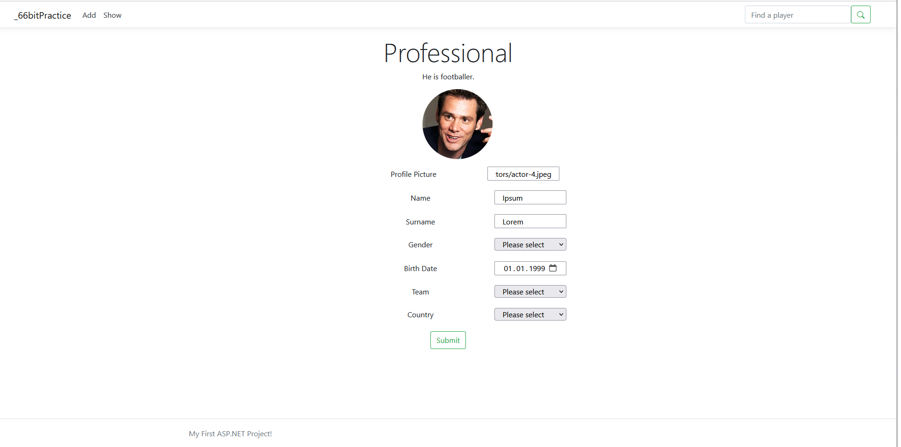

# 66bitPractice

Тестовое задание "Каталог футболистов 3.0: сделать веб-приложение с отображением списка игроков и возможностями добавлять, изменять и удалять их. 
<a href="https://practice.66bit.ru/task/csharp.pdf">Ссылка на оригинал задания</a> 
Файл создания базы данных находится в проекте => <a href="https://github.com/Abzaparov-Nikolay/66bitPractice/blob/main/script_encoding_utf16.sql">script_encoding_utf16.sql файл</a> 
Строка подключения к бд расположена в файле <a href="https://github.com/Abzaparov-Nikolay/66bitPractice/blob/main/appsettings.json">appsettings.json</a> Параметр <i>"DefaultConnectionString"</i>

Взгляд на страницу с игроками:  

 
Взгляд на страницу добавления игрока:   

 
Там же можно добавить новую команду: 

 

Игроков можно редактировать:

 

Реализовано отображение данных по игрокам в реальном времени. При изменении записей другим пользователем, данные обновляются у всех пользователей сразу же: 

 

Изменения реализованы с помощью библиотеки отправки уведомлений SignalR
